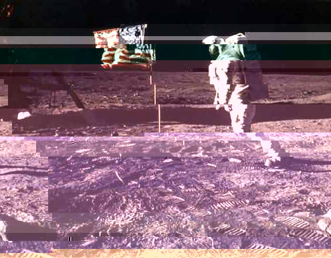
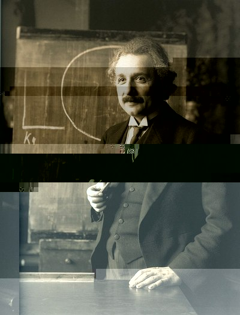
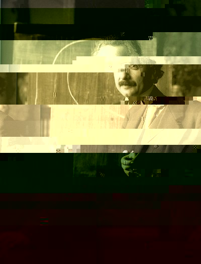
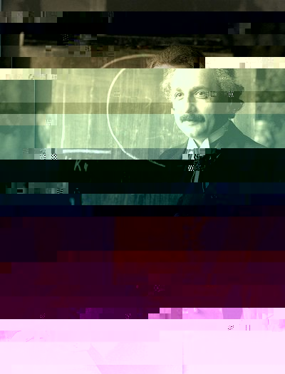
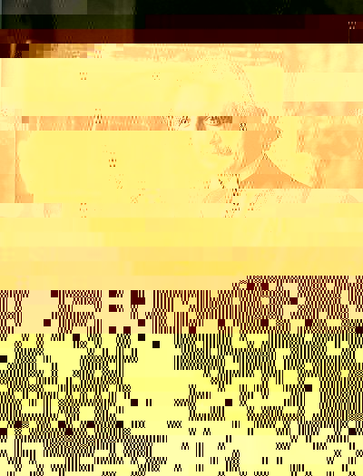
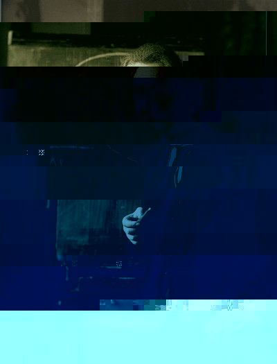
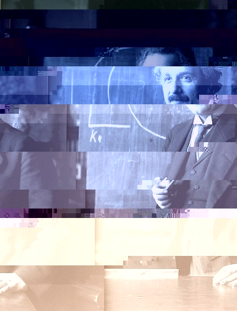
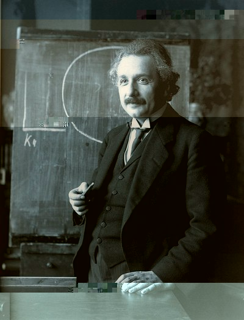
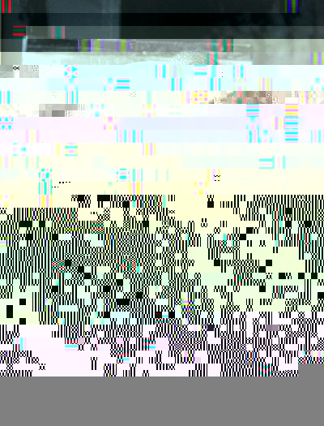
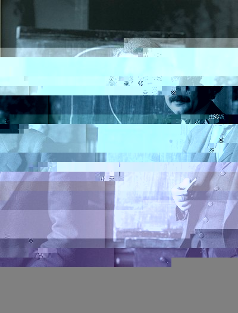

# Random JPG Glitcher
Randomly glitches JPGs (and other images) and saves output as image or video file

## install
```
pip install -r requirements.txt
```

## usage
```
./rjg.py -h
tbd...

```

## Sample Video output
```
./rjg.py vid --fps=4 --rounds=1 --steps-per-round=60 --glitch-per-step=1
```
[video (progressive)](https://raw.githubusercontent.com/zrthstr/random-jpg-glitcher/master/output/sample-progressive.mp4)


```
./rjg.py vid --fps=4 --rounds=15 --steps-per-round=6 --glitch-per-step=6
```
[video (sequential)](https://raw.githubusercontent.com/zrthstr/random-jpg-glitcher/master/output/sample-seqential.mp4)


## select source image
```
./rjg.py --source input/moonlanding.jpg img --nglitch 60
```


## Sample image output
```
for e in $(seq 10); do ./rjg.py img ; done
```

 
 
 
 
 


